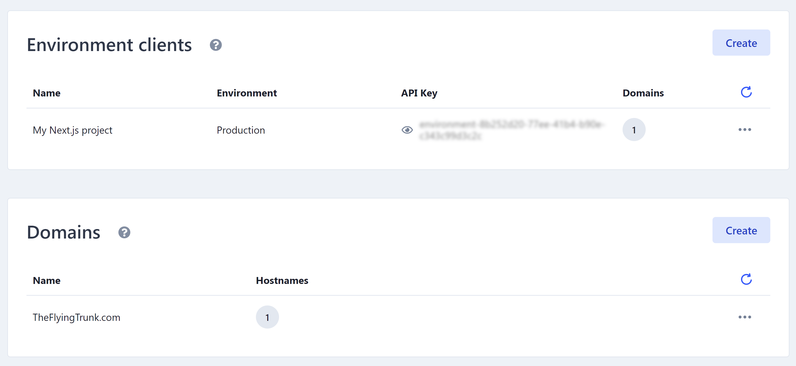

# Delivering data

Your data has been ingested into Enterspeed and transformed using our schema definitions, now it's time for the final step - delivering the data.

First, you need to set up an **Environment client** in Enterspeed. 

Go to *Settings* --> *Environment settings* --> *Environment clients* and create a one. This will generate an API key to use when getting data delivered.

## How to get data delivered
There are currently two ways of getting data delivered from the Enterspeed:
1. Using our Delivery .NET SDK
2. Using our API

### Getting data delivered via our Delivery .NET SDK
You can find more information about it here: https://github.com/enterspeedhq/enterspeed-sdk-delivery-dotnet

### Getting data delivered via our API
You can of course use our API directly to get your data delivered. [You can find the API documentation right here](../api#tag/Delivery).

:::tip
Want to see an example? See how we [fetched Enterspeed-data in Next.js](./tutorials/umbraco-nextjs/4-fetching-data-in-nextjs.md)
:::

## Domains
Say you have ingested data from a multisite setup into Enterspeed. Now you have a lot of source entities, which belong to separate "sub-sites". How do you fetch the correct data?

You do this by using domains.  

Domains in Enterspeed are linked to Environment Clients. Each domain can have multiple hostnames under it.

When fetching data from your Environment client, only data from this specific domain will be fetched.