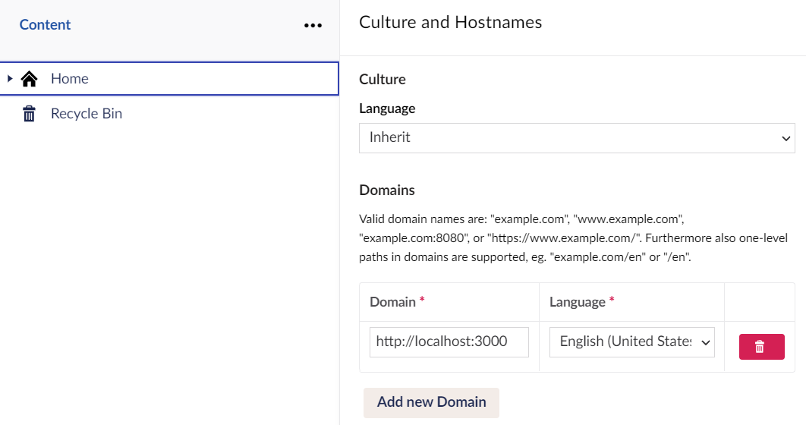

# Configuring Umbraco

In this step, we're going to:
1. Install the Enterspeed Umbraco package
2. Import our demo content
3. Configure our hostname
4. Seed content to Enterspeed manually

## Installation

### Installation for Umbraco 8
Sign into your Umbraco instance and navigate to the backoffice.

In order to send data to Enterspeed, we need to install the Enterspeed Umbraco package. Go to the **Packages** tab in the top menu and search for **“Enterspeed Umbraco source integration”**. Select the package and hit install.

:::caution
For production setups, we recommend installing the NuGet package instead. You can find it here: [https://www.nuget.org/profiles/Enterspeed](https://www.nuget.org/profiles/Enterspeed) 
:::

### Installation for Umbraco 9

Since, Umbraco 9 has removed packages installation from the backoffice, we need to install [Enterspeed.Source.UmbracoCms.V9](https://www.nuget.org/packages/Enterspeed.Source.UmbracoCms.V9/) NuGet package.

## Configuring 

Go to the **Settings** tab in the top menu and select **Enterspeed settings**.

1. Set the **Enterspeed endpoint** to [https://api.enterspeed.com/](https://api.enterspeed.com/)

2. Set your media domain (optional).

3. Insert your API key generated in the Enterspeed-app under “Sources”.

4. Test the connection and save configuration afterward.

Your data will now be synced to Enterspeed each time you publish content. 

:::tip
You can view synced data in Enterspeed by navigating to **Source Entities** and selecting your source (the name you provided when creating it) in the **Source** dropdown.
:::

## Importing content from the demo project
If you wish, you can import the Umbraco content from our [demo project](https://enterspeed-demo-nextjs.netlify.app/).

### Importing demo content for Umbraco v8

Download the **[enterspeed-demo-umbraco-content.zip](https://github.com/enterspeedhq/enterspeed-demo-nextjs/raw/master/example-data/enterspeed-umbraco-v8/enterspeed-demo-umbraco-content.zip)** - file from our [Github-repo](https://github.com/enterspeedhq/enterspeed-demo-nextjs).

Click on the **Packages** tab and select "**Install local**" on the right-hand side. Then drag the zip file onto the page, or click to select it from the dialog.

### Importing demo content for Umbraco v9
Since, Umbraco 9 has removed packages installation from the backoffice, we need to install [Enterspeed.Demos.UmbracoCms.V9.FairyTales](https://www.nuget.org/packages/Enterspeed.Demos.UmbracoCms.V9.FairyTales/) NuGet package, that will import content, data types and document types required for this demo on startup of your application.

After package installation build and start you application.

### Publishing and syncing imported demo content

Publish the site by navigating to the **Content** tab, and select the **Home** node.

Then click **the arrow** on the green "Save and Publish" button in the lower right corner, and select "**Publish with descendants**".

Check the "**Include unpublished content items**" option, and click the "**Publish with descendants**" button.

This will publish the entire site, and send the data to Enterspeed.

Go to your Enterspeed-project and navigate to Sources --> Sources entities to verify that the data have synced.

## Configuring your hostname
Go to the **Content** tab and click the three dots next to **Home**. Click the **Do something else** button at the bottom and select **Culture and Hostnames**.

Insert the same domain name as the one you entered when you configured your **hostname** in Enterspeed.

## Sending content to Enterspeed manually

When you click **Save and publish** in Umbraco, the content will automatically be sent to Enterspeed. But since we just updated our hostname, all of our content now has a new URL, which we need to be synced to Enterspeed. We do this by manually triggering an update. 

To send content manually to Enterspeed go to the **Content** tab in the top menu. Click the **Enterspeed content** tab and select **Seed**. 

To send published content to Enterspeed, click the **Seed** button. This will queue a transfer of all your Umbraco content to Enterspeed.

