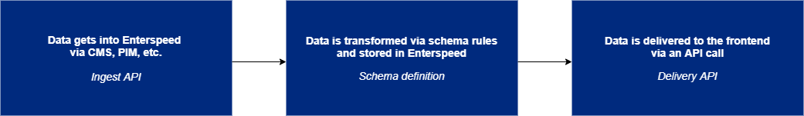

# Getting started
import ReactPlayer from 'react-player/lazy'

## The ITD-process

To get started using Enterspeed, we need to go through a three-step process - the ITD-process:
1. **I**ngest data
2. **T**ransform data
3. **D**eliver data 

### Ingesting data
In this step, we ingest the data from your current data source(s) into Enterspeed. You can do this by using one of our [integrations](./integrations) or by using our [API](./api).

***[Go to the Ingest data section.](./ingest)***

### Transforming data
Once the data have been ingested into Enterspeed, we can start transforming it. 

We do this by using our Schema designer. Here you can combine data from multiple sources and select which data you want to be available to the front-end.

***[Go to the Transforming data section.](./transform)***

### Delivering data
The data is now available to fetch via the Enterspeed Delivery API.

***[Go to the Delivering data section.](./deliver)***

## Setting up a tenant
A tenant is like a property for your website. You can have multiple tenants on your Enterspeed account.

In the video below we'll show you how to set up your tenant.
<ReactPlayer url='https://www.youtube-nocookie.com/watch?v=q9iaK7CiYB0' />

## Use the Enterspeed starter template
If you want to test out Enterspeed with some "real data" you can use our starter template.

Our starter template is built around a fictional Umbraco store. 

To use the starter template, click the "Use Enterspeed Starter template"-box when creating a new tenant.
<ReactPlayer url='https://www.youtube-nocookie.com/watch?v=MUGZBGbtv8E' />
