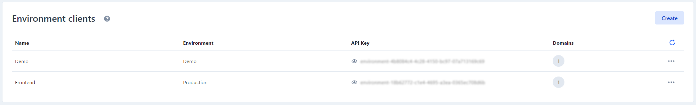

# Using environment clients

Environment clients are the "connection" between Enterspeed and your front-end and, as the name suggests, it is also tied up to one of your environments.

:::info
You can only have one environment per environment client.
:::

Moreover, environment clients also have domains attached to them, which makes it possible to filter your data based on the host names attached to the domain name.

However, unlike environments, you can have as many domains attached to your environment client as you wish, but you will need at least one.

:::info
An environment client won't work without a domain attached to it.
:::

You can also choose to have a single environment client per domain if you have multiple sites, for instance for separation of concern.

## Creating an environment

Click the _Settings_-tab and then click the _Environment settings_-tab in the sidemenu. Scroll down to Domains and click the _Create_-button.

Give your Environment client a name and select an environment.

Next, select the domains you wish to add to the environment client and then click _Save changes_.

Once the environment client has been created an API key will be available. If needed the key can be regenerated by clicking the three dots next to the environment client (_Settings_) and selecting _Regenerate API Key_.

## API Scopes

API scopes allow you to control which Enterspeed APIs your environment client can access, following the principle of least privilege. This is particularly useful when integrating with AI agents or third-party services where you want to limit access to only the necessary endpoints.

### Default Scopes

When creating a new environment client, it automatically receives these default scopes:

- **Delivery API** - Access to content delivery endpoints
- **Query API** - Access schema-transformed and auto indexed data
- **Routes API** - Access to route management and execution

### Available Scopes

| Scope                            | Description                                          | Requirements              |
| -------------------------------- | ---------------------------------------------------- | ------------------------- |
| **Delivery API**                 | Content delivery endpoints                           | None                      |
| **Query API**                    | Access schema-transformed and auto indexed data      | None                      |
| **Routes API**                   | Routes API access                                    | None                      |
| **MCP Server (AI Agent Access)** | Enables MCP tool endpoints for AI agents             | Requires Query API        |

:::info
The MCP Server scope is designed for AI agents and does not provide data access by itself. It must be combined with the Query API scope to function properly.
:::

### Scope Presets

For convenience, the Management App provides several preset configurations:

- **Standard** - Delivery + Routes + Query (default for regular applications)
- **AI Assistant (Query + MCP Server)** - Query + MCP Server — Full data access for AI agents
- **Custom** - Manually select specific scopes

### Managing Scopes

You can configure scopes when creating or updating an environment client through the Management App. Existing environment clients without explicit scopes will continue to work with the default scope configuration, ensuring backward compatibility.

## Index-Level Scopes (Advanced)

Beyond controlling which APIs your environment client can access, you can also configure **index-level scopes** within the Query API to restrict access to specific data. This provides fine-grained control over exactly what content an AI agent or integration can access.

### Schema indices

When your environment client has Query API access, you can optionally restrict it to specific schema indices:

- **All indices (default)** - Access to all deployed index schemas
- **Specific indices** - Access only to selected schemas (e.g., `blogpost`, `product`)
- **Wildcard patterns** - Access to schemas matching patterns (e.g., `blog*` matches `blogpost`, `blogpage`, etc.)

**Example use cases:**

- AI agent for blog content: Restrict to `blogpost` and `blogpage` indices only
- Product recommendation system: Restrict to `product` and `category` indices only
- Content migration tool: Use `cms*` pattern for all CMS-related schemas

### Auto indices

You can also optionally restrict Query API access to specific auto-indexed source group and entity type combinations:

- **All sources (default)** - Access to all auto-indexed source entities
- **Specific combinations** - Access only to selected source group + entity type pairs (e.g., `cms:page`, `shop:product`)
- **Wildcard patterns** - Access to all entity types within a source group (e.g., `cms:*`)

**Format:** Index scopes use the pattern `sourceGroup:entityType`

**Example configurations:**

- CMS content only: `cms:page`, `cms:article`, `cms:blogpost`
- E-commerce data: `shop:product`, `shop:category`, `shop:inventory`
- All CMS content: `cms:*`

### Index Scope Behavior

:::info
Index scopes are **optional** and only apply when the **Query API** component scope is enabled. If no index scopes are configured, the client has access to **all** data within its allowed component scopes.
:::

This two-layer approach provides maximum flexibility:

1. **Component scopes** control which APIs can be accessed
2. **Index scopes** control which specific data within those APIs can be accessed
