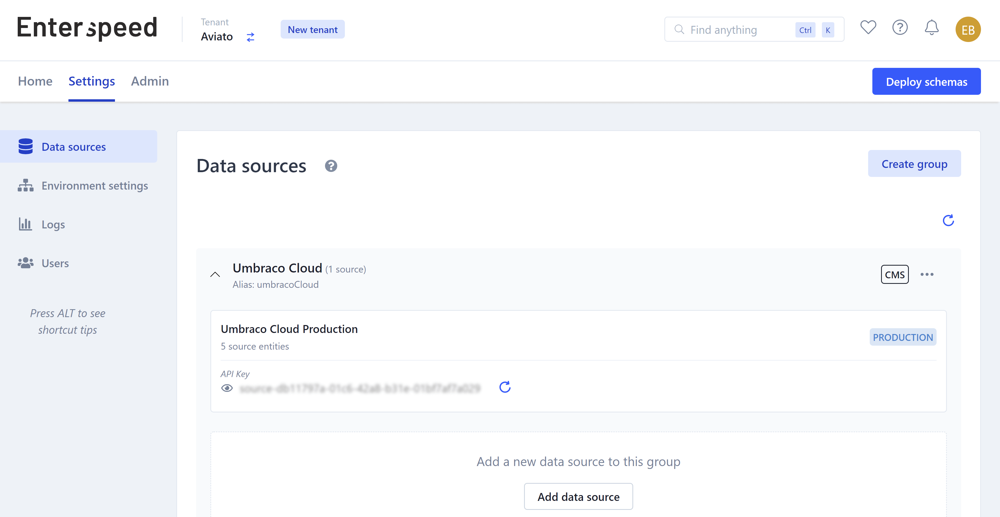
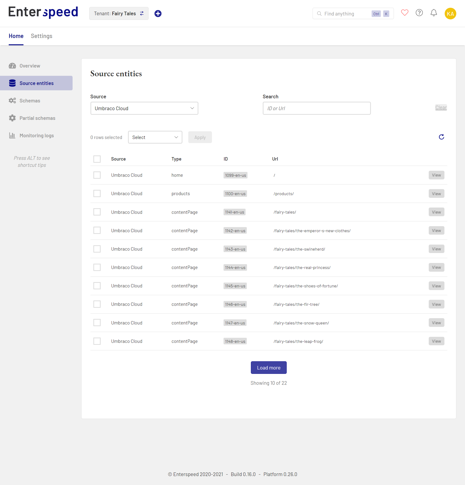

# Ingesting data

import ReactPlayer from 'react-player/lazy'

The first step when working with Enterspeed is to get your current data sources into Enterspeed.

First, you need to set up a **Data source** in Enterspeed. Go to *Settings* --> *Data Sources* and create a one. This will generate an API key to use when ingesting data.

## How to ingest data
There are three ways of doing this:
1. Using one of our integrations
2. Using our .NET SDK
3. Using our API.

### Ingesting data via an integration
Using one of our [integrations](./integrations/overview.md) is the easiest way to get data ingested. This integration takes care of calling the Enterspeed Ingest API when changes occur in your CMS.

We currently have integrations for Umbraco V7, Umbraco V8, and Umbraco V9.

### Ingesting data via our .NET SDK
Another way of ingesting data is by using our .NET SDK. You'll find more information about it here: https://github.com/enterspeedhq/enterspeed-sdk-dotnet

### Ingesting data via our API
Last but now least, you can of course use our API directly to ingest your data. [You can find the API documentation right here.](./api#tag/Ingest)
<ReactPlayer url='https://www.youtube-nocookie.com/watch?v=QtZoAz8k14Q' />

## Viewing ingested data
Once your data has been ingested into Enterspeed, it will be visible under Source Entities.

You can click on the View button to see the data for the source entity. 

