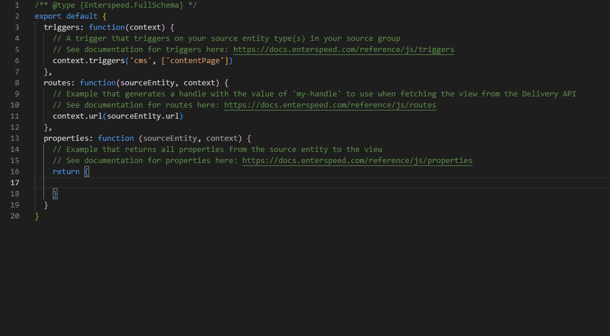
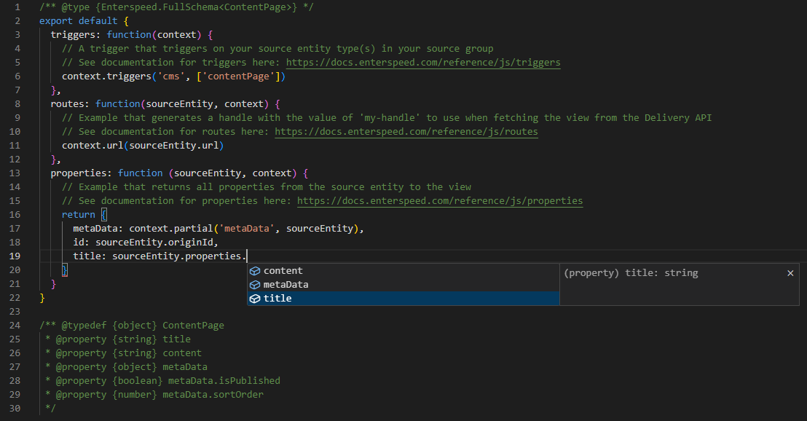

# JSDoc

By default, JavaScript schemas are created with a `@type` expression, describing the type of schema and providing IntelliSense in the editor using [JSDoc](https://jsdoc.app/).

```js title="@type expression"
/** @type {Enterspeed.FullSchema} */
```

With the `@type` expression, you get IntelliSense on all the functions in your schema, the parameters (sourceEntity and context objects), and the return types.



However, since Enterspeed is so flexible and you can ingest all types of data, Enterspeed doesn't know about the custom properties you have ingested in the source entities and therefore can't provide IntelliSense on these properties by default.

:::tip
The schema types are publicly available from our NPM package: [@enterspeed/js-schema-types](https://www.npmjs.com/package/@enterspeed/js-schema-types).
:::

## Creating your own type definitions

All schema types also come in a generic version where you can provide the type of your source entity described in JSDoc. Hereby enabling IntelliSense for all your custom properties of a source entity.

First, you need to create [type definition](https://jsdoc.app/tags-typedef) describing your source entity.

```js title="@type definition"
/** @typedef {object} ContentPage
 * @property {string} title
 * @property {string} content
 * @property {object} metaData
 * @property {boolean} metaData.isPublished
 * @property {number} metaData.sortOrder
 */
```

:::tip
If you prefer not to create your type definitions manually, there are many free only tools available that can generate them for you. Simply paste the JSON from your source entity into your chosen tool.

[transform.tools](https://transform.tools/json-to-jsdoc) is a great example.
:::

## Apply a custom type definition

In order to use your custom type definition you simply use the generic version of the schema type you are working with (FullSchema, PartialSchema, ...).

```js title="Generic @type expression"
/** @type {Enterspeed.FullSchema<ContentPage>} */
```

You now have IntelliSense on your custom source entity properties.



## Lookups and custom functions

The generic version of the schema type only describes the source entity passed into the schema. But if you do lookups in your schema, you can also use JSDoc to describe the source entities you fetch with lookup.

```js title="Lookup call with defined return type"
const products = /** @type {Enterspeed.ISourceEntity<Product>[]} */ 
                    (await context.lookup("type eq 'product'").toPromise());
```

For custom functions you can also describe the parameters and return type.

```js title="Function with described parameters"
/**
 * @param {Enterspeed.ISourceEntity<Product>} sourceEntity
 * @returns {boolean}
 */
function isProductAvailable(sourceEntity) {
  return sourceEntity.properties.status == 'available' 
            && sourceEntity.properties.stockCount > 0;
}
```