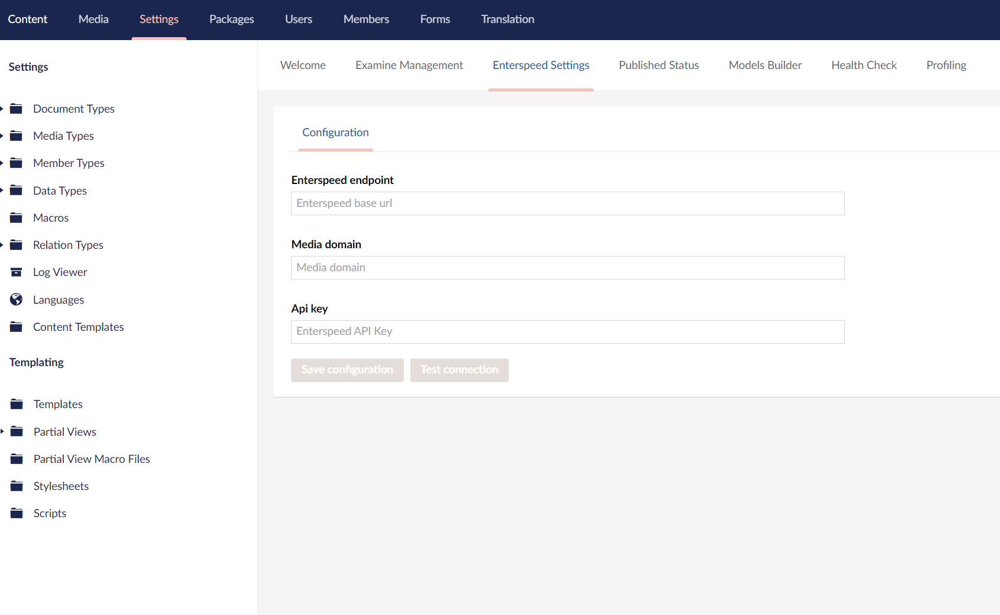

# Getting started Umbraco V8 & Enterspeed

The easiest way getting started with Umbraco and Enterspeed is using the pre-built Umbraco integration. 

**GitHub: [Enterspeed Source Umbraco CMS](https://github.com/enterspeedhq/enterspeed-source-umbraco-cms)**

This integration takes care of calling the Enterspeed Ingest API when changes occurs in Umbraco. For a full overview of what Umbraco entities are send to Enterspeed, please see Umbraco entities.

## Installation
**Prerequisite:** Umbraco 8.7 or above.

The fastest way to get up and running, is to install the Enterspeed Umbraco integration with NuGet.

**NuGet:** [Enterspeed.Source.UmbracoCms.V8](https://www.nuget.org/packages/Enterspeed.Source.UmbracoCms.V8/)

You can either install it manually from the NuGet manager in Visual Studio or execute the Install-Package command:

```
Install-Package Enterspeed.Source.UmbracoCms.V8
```

**Install specific version**

```
Install-Package Enterspeed.Source.UmbracoCms.V8 -Version <version>  
```

:::info
Using Umbraco Cloud? If you have used the Umbraco Cloud UaaS.cmd tool to setup your solution, 
you need to manually update the referenced dlls after installing the Enterspeed NuGet package. Specifically Microsoft.Bcl.AsyncInterfaces.dll needs to be updated. 

From Visual Studio navigate to the [Namespace].Web\bin folder, and right click on Microsoft.Bcl.AsyncInterfaces.dll, and select "Update Reference".
:::

When the installation above has completed two new dashboards has been added to your Umbraco solution. 

- **Content:** To seed and check errors when data is ingested
- **Settings:** To configure Enterspeed in Umbraco

## Configuration
Before Umbraco starts sending data to Enterspeed you will need to add a little piece of configuration.

Luckily this can easily be done within Umbraco itself or via [Web.config](https://support.enterspeed.com/support/solutions/articles/80000605456-getting-started#web-config).

### Source API key and Ingest endpoint
Firstly go to Settings and then select the Enterspeed Settings dashboard in your Umbraco backoffice.

You should see something like this:



#### Enterspeed endpoint
The Enterspeed endpoint is the ingest endpoint, that Umbraco will use to send content to Enterspeed.

Unless you have gotten a specific Enterspeed endpoint to call, please use: [https://api.enterspeed.com](https://api.enterspeed.com/)

#### Media domain
The Media domain is to tell the Enterspeed integration where you have your media placed, e.g. if you have a CDN.

If you leave it empty, it will just use your current Umbraco installation domain.

#### Api key
Before you can insert an API key, you must have created a Source within the [Enterspeed Management](https://app.enterspeed.com/source).

The API key looks something like this: source-xxxxxxxx-xxxx-xxxx-xxxx-xxxxxxxxxxxx. When you have gotten it, insert it in the Api key input field.

When you have inserted the Enterspeed endpoint and the Api key click on Test connection and make sure that you get a successful response. When you do go ahead and Save configuration.

## Web.config app settings

For Web.config, please use the following appSettings:

```xml
<add key="Enterspeed.Endpoint" value="" />

<add key="Enterspeed.MediaDomain" value="" />

<add key="Enterspeed.Apikey" value="" />
```

## Processed Umbraco entities
Here is an overview of what is processed and send to Enterspeed and what is not.

### Processed entities
- Published content
- Dictionary

### Not processed entities
- Media
- Members
- Draft content (unpublished content/saved content)