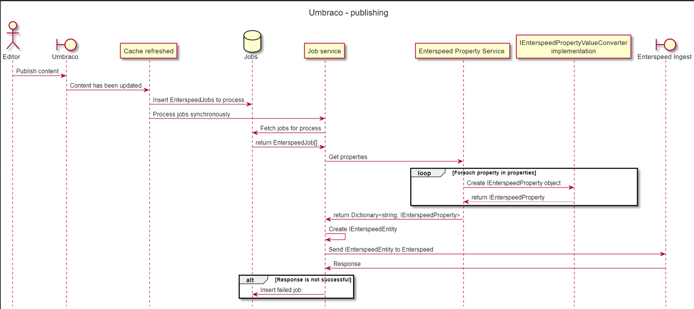

# Publishing step by step
When the editor publishes a node the cache refreshed event is triggered and the Enterspeed Umbraco integration listens to this event, to send the updated content to Enterspeed. When this event is triggered these steps are executed synchronously:

1. a new EnterspeedJob is added to a database for processing
2. the newly added job is requested to be processed immediately
3. the published content from Umbraco is fetched from the cache
4. each property on the IPublishedContent is converted to an IEnterspeedProperty with an IEnterspeedPropertyValueConverter
5. a UmbracoContentEntity is created 
6. the content entity is sent to the Enterspeed Ingest API
7. if the response is successful nothing happens, if it is not:
    1. the EnterspeedJob is re-inserted in the database as failed
    2. the failed jobs can be viewed on the content dashboard

If you wish you can checkout the sequence diagram for the process here:

```
@startuml
title Umbraco - publishing

hide footbox

actor "Editor" as EDITOR
boundary "Umbraco" as UMBRACO
participant "Cache refreshed" as CACHE_REFRESHED
database "Jobs" as JOBS
participant "Job service" as JOBS_SERVICE
participant "Enterspeed Property Service " as PROPERTY_SERVICE
participant "IEnterspeedPropertyValueConverter\nimplementation" as PROPERTY_VALUE_CONVERTER
boundary "Enterspeed Ingest" as INGEST

EDITOR -> UMBRACO: Publish content

UMBRACO -> CACHE_REFRESHED: Content has been updated
CACHE_REFRESHED -> JOBS: Insert EnterspeedJobs to process
CACHE_REFRESHED -> JOBS_SERVICE: Process jobs synchronously

JOBS_SERVICE -> JOBS: Fetch jobs for process
JOBS -> JOBS_SERVICE: return EnterspeedJob[]
JOBS_SERVICE -> PROPERTY_SERVICE: Get properties

loop Foreach property in properties
  PROPERTY_SERVICE -> PROPERTY_VALUE_CONVERTER: Create IEnterspeedProperty object
  PROPERTY_VALUE_CONVERTER --> PROPERTY_SERVICE: return IEnterspeedProperty
end

PROPERTY_SERVICE -> JOBS_SERVICE: return Dictionary<string, IEnterspeedProperty>

JOBS_SERVICE -> JOBS_SERVICE: Create IEnterspeedEntity
JOBS_SERVICE -> INGEST: Send IEnterspeedEntity to Enterspeed
INGEST -> JOBS_SERVICE: Response

alt Response is not successful
  JOBS_SERVICE -> JOBS: Insert failed job
end
```

