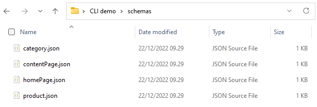

# Getting started

import {Card, CardContainer} from '../../../src/components/card';
import IntroducingEnterspeedCliVideo from '../../../static/img/docs/tooling/introducing-enterspeed-cli-video.png';

<Card link="https://www.youtube.com/watch?v=KVPvNjcZLvc" image={IntroducingEnterspeedCliVideo} isExternal={true} />

## 1. Installation

[Download the latest release](https://github.com/enterspeedhq/enterspeed-cli/releases) and select the asset for your operation system.  

Also you can add the location to your es-cli in the environment path to make the cli available globally if you want.

## 2. Help options

If you don't want to go to the [documentation](https://github.com/enterspeedhq/enterspeed-cli) every time you are using new commands, you can use the help option to see available commands and options

``` 
es-cli -h
```

``` 
Description:

Usage:
  es-cli [command] [options]

Options:
  -v, --verbose      verbose
  --apiKey <apiKey>
  --version          Show version information
  -?, -h, --help     Show help and usage information

Commands:
  login               Login using OAuth
  tenant              Tenant
  environment         Environment
  environment-client  Environment client
  domain              Domain
  source-group        Source group
  source              Source
  views               Generated views
  source-entity       Source entities
  schema              Schemas
  deployment
``` 

## 3. Authentication

Before you can call any of the comands you must first authenticate. You do that using the `login` command. 

This will open a browser window where you can sign in with your Enterspeed credentials.

``` 
es-cli login
```

:::info
It's also possible to authenticate using an **[API key](https://github.com/enterspeedhq/enterspeed-cli#api-key--authentication)**. This is especially useful if you are using the CLI in a pipeline context like CI/CD.
:::

## 4. Setting the right tenant

After authenticating the first thing you must do, is to make sure you are working on the right tenant.

To get a list of all available tenant use the following command.

``` 
es-cli tenant list
```

After that you can set the tenant using the id from the list.

``` 
es-cli tenant set gid://Tenant/5197b4d4-6bdf-4f63-a91b-872905ad1941
```

## 5. Cloning schemas from Enterspeed to you local machine

Now that we have authenticated and selected the right tenant we can start working witht the schemas.

:::tip
You can use the help options for the individual commands as well to get specific help for e.g. the schemas: `es-cli schema -h`
:::

The `schema clone` command will clone all the schemas from your tenant to you local machine so you can start working with your schemas locally.

``` 
es-cli schema clone
```

This will create a folder called schemas with all you schemas.



## 6. Saving a schema

Now open up one of your schemas, make a change to the schema and save it. Once you save the schema in your editor, note that the schema is only saved on your local machine.

To save the new changes to your schema in Enterspeed you use the `schema save` which takes the alias of the schema as argument, in this case `product`.

``` 
es-cli schema save product
```

Now if you open up the same schema in Enterspeed you can see the the schemas has been updated in Enterspeed.

## 7. Deploying a schema

The last step for this guide is to deploy the schema to Enterspeed so that the changes to our schema will be refleced in the views.

To deploy a schema we would need to once again provide the alias of the schema that we want to deploy and also we would need to provide the environment that we would deploy our schema to.

``` 
es-cli schema deploy product -e "Development"
```

This was quick guide to show how to get started and to show just some of the tasks you can do with the CLI.
