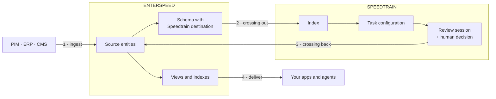

Enterspeed and Speedtrain are two separate systems. Enterspeed is the data supply chain — it ingests from your source systems and delivers to your applications. Speedtrain is where AI work happens to that data.

Data crosses between them **twice**: out to Speedtrain to be enriched, and back into Enterspeed once a person has approved it. Everything downstream — your website, your app, your search index — reads from Enterspeed and never talks to Speedtrain directly.

## The four steps

<Steps>
  <Step title="Your data lands in Enterspeed" icon="arrow-right-to-bracket">
    Your source systems push records into Enterspeed, where each becomes a **source entity**. This is ordinary Enterspeed ingestion — Speedtrain is not involved yet, and nothing changes about how you already do it.

    [Ingesting data](/enterspeed/ingest) · [Source entities](/enterspeed/key-concepts/source-entities) · [Integrations](/enterspeed/integrations/overview)
  </Step>

  <Step title="Enterspeed pushes it out to Speedtrain" icon="arrow-up-right-from-square">
    You set a **Speedtrain destination** on the schema whose views you want enriched. Enterspeed then pushes those views into a Speedtrain index, where they become documents a task can run over.

    Because the destination is set per schema, you choose exactly which data crosses over — not the whole environment.

    The view can also carry an `actions` array naming the task configurations to run. That normally originates in the system the data came from — a button in the customer's own admin that asks for a specific task — and Enterspeed passes it through untouched. Send the data on its own instead, and Speedtrain indexes it until someone starts a session there.

    [Speedtrain destination](/enterspeed/integrations/speedtrain) · [Schemas](/enterspeed/key-concepts/schemas) · [Content sources](/speedtrain/key-concepts/content-sources)
  </Step>

  <Step title="Speedtrain does the work" icon="wand-magic-sparkles">
    A **task configuration** describes the job: who the AI is, what the output varies across, and how each result will be judged. Running it over a document produces an output, scored by your quality rules and routed through a quality gate.

    Nothing leaves Speedtrain until it has been approved — either by a person in a **review session**, or automatically where the approval policy allows it.

    [Task configurations](/speedtrain/key-concepts/task-configurations) · [Quality gates](/speedtrain/key-concepts/quality-gates) · [Review sessions](/speedtrain/key-concepts/review-sessions)
  </Step>

  <Step title="Approved content returns to Enterspeed" icon="arrow-right-to-bracket">
    A Speedtrain **destination** delivers accepted content back into an Enterspeed source, where it arrives as source entities like any other input. From there your schemas pick it up, and it reaches your applications through the Delivery and Query APIs.

    The enriched content is now ordinary Enterspeed data. Nothing downstream needs to know Speedtrain produced it.

    [Speedtrain destinations](/speedtrain/key-concepts/destinations) · [Views](/enterspeed/key-concepts/views) · [Delivering data](/enterspeed/deliver)
  </Step>
</Steps>

<Info>
  Step 4 lands content back in Enterspeed as **source entities**, not as finished views. That is deliberate — enriched content re-enters the supply chain at the same point your original data did, so the schemas, routing, and delivery you already have apply to it unchanged.
</Info>

## Which product owns what

| | Enterspeed | Speedtrain |
|---|---|---|
| **Holds** | Source entities, schemas, views, indexes | Indexes of documents, task configurations |
| **Does** | Ingests, transforms, routes, delivers | Generates content, scores it, routes it to people |
| **Talks to** | Your source systems and your applications | Enterspeed only |
| **Changes your data?** | Transforms it into views | Never edits the source; produces new content |

<Warning>
  Speedtrain reads its index and writes to its destination. It never writes back into the index it read from, so an enrichment job cannot overwrite the data it was given.
</Warning>

## A worked example

You sell 40,000 products and want a description for each, in four languages.

<Steps>
  <Step title="Products reach Enterspeed">
    Your PIM pushes each product as a source entity, with the attributes it already has — SKU, material, weight, colour.
  </Step>

  <Step title="A schema sends them to Speedtrain">
    You write a schema that shapes the product view, and set a Speedtrain destination on it. Each product arrives in a Speedtrain index as one document.
  </Step>

  <Step title="A task writes the descriptions">
    A task configuration with a language variant produces four descriptions per product. Quality rules check each one against your brand terms; the gate flags the ones that need a human.
  </Step>

  <Step title="Accepted descriptions flow back">
    A Speedtrain destination pushes the approved descriptions into an Enterspeed source. Your existing product schema picks them up, and the website reads them from the Delivery API like any other field.
  </Step>
</Steps>

## Where to go next

<Columns cols={3}>
  <Card title="How Speedtrain works" icon="diagram-project" href="/speedtrain/how-it-works">
    The path a record takes inside Speedtrain, once it has arrived.
  </Card>

  <Card title="Set up the destination" icon="plug" href="/enterspeed/integrations/speedtrain">
    Configure the Enterspeed side so your views reach Speedtrain.
  </Card>

  <Card title="Getting started" icon="circle-play" href="/speedtrain/getting-started/intro">
    Build and run your first task configuration.
  </Card>
</Columns>
